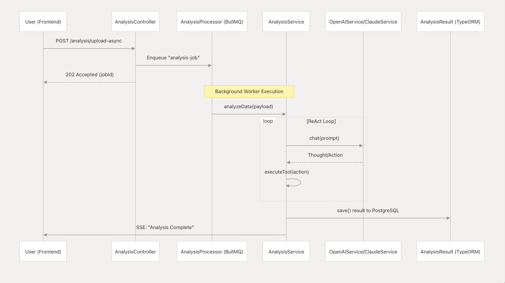

# AI Data Analyzer (自动化数据分析 AI Agent) 

> 🎉 **项目状态说明**：本项目《使用 Next.js 与 Nest.js 构建自动化数据分析 AI Agent》**第一季教程已圆满完结！**
> 当前代码库是一个完整的教学级“脚手架”，涵盖了从前端 3D 可视化到后端 AI Agent 编排、消息队列以及 Docker CI/CD 的全栈链路。欢迎 Fork 并基于此演进你的专属商业化产品。

基于 Next.js 与 Nest.js 构建的全栈自动化数据分析 AI Agent。该项目结合了大语言模型 (LLM)，实现了从数据上传、自动化清洗、智能分析到可视化图表呈现的完整数据管道。

## 🗺️ 课程架构与技术蓝图

本项目配套了 5 大模块共 25 节详细的图文教程。以下是本项目的全栈架构思维导图与相关架构图：

### 课程架构与技术蓝图


### 整体基础设施图


### 组件交互环路


## 📚 教程与系列文章

本项目配有详细的从零到一构建教程及相关文档，强烈建议结合教程学习项目源码：

👉 **[使用 Next.js 与 Nest.js 构建自动化数据分析 AI Agent（微信公众号系列文章集合）](https://mp.weixin.qq.com/mp/appmsgalbum?action=getalbum&__biz=MzU5MjM4MTA5MA==&scene=1&album_id=4431259597206634496&count=3#wechat_redirect)**

👉 **[DeepWiki 项目文档：AI Data Analyzer](https://deepwiki.com/you-want/ai-data-analyzer)**

## 🚀 核心特性

- **多模型支持**: 统一的 `ILLMService` 接口，无缝切换 OpenAI、Claude 及本地大模型 (如 Ollama + Qwen)。
- **实时流式反馈**: 基于 Server-Sent Events (SSE) 的打字机输出效果。
- **Agent 状态推送**: 通过 WebSocket (Socket.io) 实时推送 AI Agent 的思考过程与执行步骤。
- **异步任务队列**: 集成 BullMQ 与 Redis，支持大规模数据的后台异步处理，不阻塞主流程。
- **严格数据校验**: 结合 `class-validator` 与 `Zod` 实现强大的数据输入输出验证及 AI 幻觉重试机制。
- **全栈架构**: 现代化技术栈组合 (NestJS 后端 + Next.js 前端 + PostgreSQL 数据库)。

## 🛠 技术栈

### Backend (后端)
- **框架**: [NestJS](https://nestjs.com/)
- **语言**: TypeScript
- **数据库**: PostgreSQL + TypeORM
- **队列缓存**: Redis + BullMQ
- **实时通信**: SSE + Socket.io
- **AI 集成**: OpenAI SDK

### Frontend (前端)
- **框架**: [Next.js](https://nextjs.org/) (App Router) + React 19
- **语言**: TypeScript
- **样式**: TailwindCSS v4
- **数据获取**: SWR
- **2D 可视化**: Apache ECharts (`echarts-for-react`) + Recharts
- **3D 可视化**: Three.js + React Three Fiber (`@react-three/fiber`, `@react-three/drei`)

## 📦 快速开始

### 1. 环境准备
确保你的本地安装了：
- Node.js (>= 22)
- [pnpm](https://pnpm.io/)
- Docker (用于快速启动数据库和 Redis)

### 2. 启动依赖服务 (PostgreSQL & Redis)
你可以使用 Docker 快速启动所需的中间件：
```bash
# 启动 PostgreSQL
docker run --name ai_analyzer_postgres -e POSTGRES_USER=postgres -e POSTGRES_PASSWORD=password -e POSTGRES_DB=ai_analyzer -p 5432:5432 -d postgres:15-alpine

# 启动 Redis (用于 BullMQ)
docker run --name my-redis -p 6379:6379 -d redis
```

### 3. 安装依赖与配置

#### 后端配置
```bash
cd backend
pnpm install
```

在 `backend` 目录下创建 `.env` 文件，并配置你的大模型 API 密钥及数据库连接信息：
```env
# 数据库配置
DATABASE_HOST=localhost
DATABASE_PORT=5432
DATABASE_USER=postgres
DATABASE_PASSWORD=password
DATABASE_NAME=ai_analyzer

# AI 模型配置 (例如使用 OpenAI)
OPENAI_API_KEY=your_api_key_here
```

#### 前端配置
```bash
cd frontend
pnpm install
```

### 4. 启动服务

**启动后端服务：**
```bash
cd backend
pnpm run start:dev
```
*注：项目中已集成 `kill-port`，启动时会自动清理占用的 `3001` 端口，提供丝滑的开发体验。*
服务将运行在：`http://localhost:3001`

**启动前端服务：**
```bash
cd frontend
pnpm run dev
```
前端服务将运行在：`http://localhost:3000`

## 🤝 参与贡献

欢迎提交 Issue 和 Pull Request，一起完善这个 AI Agent 数据分析平台！

## 📄 开源协议

本项目基于 [MIT License](LICENSE) 开源，您可以自由地使用、修改和分发。