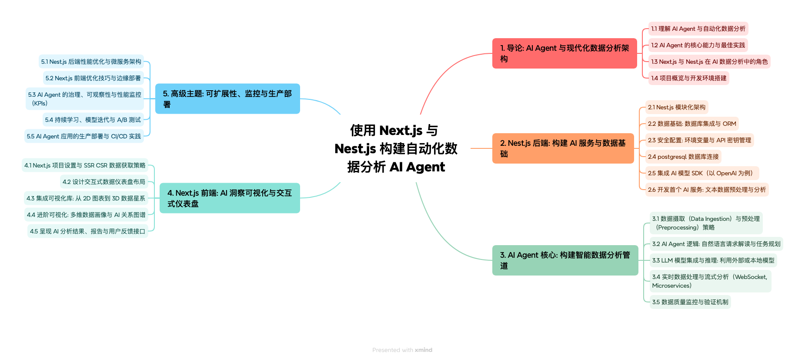
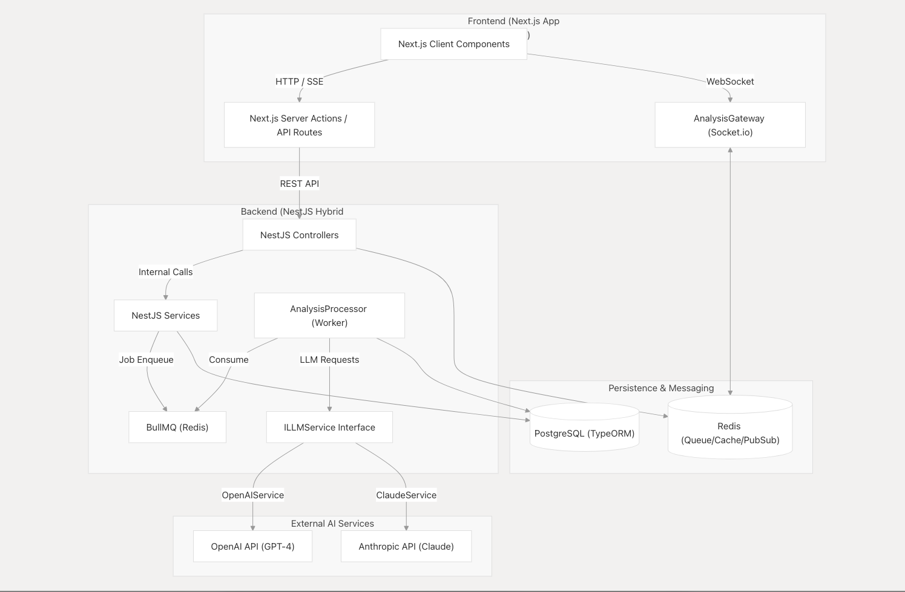

# AI Data Analyzer (自动化数据分析 AI Agent) 

> 🎉 **项目状态说明**：本项目《使用 Next.js 与 Nest.js 构建自动化数据分析 AI Agent》**第一季教程已圆满完结！**
> 当前代码库是一个完整的教学级“脚手架”，涵盖了从前端 3D 可视化到后端 AI Agent 编排、消息队列以及 Docker CI/CD 的全栈链路。欢迎 Fork 并基于此演进你的专属商业化产品。

基于 Next.js 与 Nest.js 构建的全栈自动化数据分析 AI Agent。该项目结合了大语言模型 (LLM)，实现了从数据上传、自动化清洗、智能分析到可视化图表呈现的完整数据管道。

## 🗺️ 课程架构与技术蓝图

本项目配套了 5 大模块共 25 节详细的图文教程。以下是本项目的全栈架构思维导图与相关架构图：

### 课程架构与技术蓝图


### 整体基础设施图


### 组件交互环路


## 📚 教程与系列文章

本项目配有详细的从零到一构建教程及相关文档，强烈建议结合教程学习项目源码：

👉 **[使用 Next.js 与 Nest.js 构建自动化数据分析 AI Agent（微信公众号系列文章集合）](https://mp.weixin.qq.com/mp/appmsgalbum?action=getalbum&__biz=MzU5MjM4MTA5MA==&scene=1&album_id=4431259597206634496&count=3#wechat_redirect)**

👉 **[DeepWiki 项目文档：AI Data Analyzer](https://deepwiki.com/you-want/ai-data-analyzer)**

## 🚀 核心特性

- **多模型支持**: 统一的 `ILLMService` 接口，无缝切换 OpenAI、Claude 及本地大模型 (如 Ollama + Qwen)。
- **实时流式反馈**: 基于 Server-Sent Events (SSE) 的打字机输出效果。
- **Agent 状态推送**: 通过 WebSocket (Socket.io) 实时推送 AI Agent 的思考过程与执行步骤。
- **异步任务队列**: 集成 BullMQ 与 Redis，支持大规模数据的后台异步处理，不阻塞主流程。
- **严格数据校验**: 结合 `class-validator` 与 `Zod` 实现强大的数据输入输出验证及 AI 幻觉重试机制。
- **全栈架构**: 现代化技术栈组合 (NestJS 后端 + Next.js 前端 + PostgreSQL 数据库)。

## 🛠 技术栈

### Backend (后端)
- **框架**: [NestJS](https://nestjs.com/)
- **语言**: TypeScript
- **数据库**: PostgreSQL + TypeORM
- **队列缓存**: Redis + BullMQ
- **实时通信**: SSE + Socket.io
- **AI 集成**: OpenAI SDK

### Frontend (前端)
- **框架**: [Next.js](https://nextjs.org/) (App Router) + React 19
- **语言**: TypeScript
- **样式**: TailwindCSS v4
- **数据获取**: SWR
- **2D 可视化**: Apache ECharts (`echarts-for-react`) + Recharts
- **3D 可视化**: Three.js + React Three Fiber (`@react-three/fiber`, `@react-three/drei`)

## 📦 快速开始

### 1. 环境准备
确保你的本地安装了：
- Node.js (>= 22)
- [pnpm](https://pnpm.io/)
- Docker (用于快速启动数据库和 Redis)

### 2. 启动依赖服务 (PostgreSQL & Redis)

项目根目录已有 `docker-compose.yml`，直接用 Docker Compose 启动即可。

**首次启动（创建容器）：**
```bash
# 在项目根目录执行
docker compose up -d
```
这会自动创建并启动 PostgreSQL（`ai_analyzer_postgres`）和 Redis（`ai_analyzer_redis`）两个容器。

**后续启动（容器已存在）：**
```bash
docker compose up -d
# 或者
docker start ai_analyzer_postgres ai_analyzer_redis
```

**停止服务：**
```bash
docker compose down        # 停止并移除容器（数据保留在 volume 中）
docker compose stop        # 仅停止容器（不移除）
```

### 3. 安装依赖与配置

#### 后端配置
```bash
cd backend
pnpm install
```

在 `backend` 目录下创建 `.env` 文件，并配置你的大模型 API 密钥及数据库连接信息：
```env
# 数据库配置
DATABASE_HOST=localhost
DATABASE_PORT=5432
DATABASE_USER=ai_data_user
DATABASE_PASSWORD=ai_data_password
DATABASE_NAME=ai_analysis_db

# Redis 配置
REDIS_HOST=localhost
REDIS_PORT=6379
REDIS_PASSWORD=redis_dev_password

# AI 模型配置 (使用 OpenAI)
OPENAI_BASE_URL=https://api.openai.com/v1
OPENAI_API_KEY=your_api_key_here  # 替换为你的 OpenAI API Key
OPENAI_MODEL=gpt-4o

# 或者使用阿里云通义千问
# OPENAI_BASE_URL=https://dashscope.aliyuncs.com/compatible-mode/v1
# OPENAI_API_KEY=your_api_key_here  # 替换为你的阿里云 API Key
# OPENAI_MODEL=qwen3.7-plus

# 或者使用本地 Ollama 模型（取消注释以下三行）
# OPENAI_API_KEY=ollama
# OPENAI_BASE_URL=http://localhost:11434/v1
# OPENAI_MODEL=qwen2.5

# JWT 密钥（生产环境务必修改）
JWT_SECRET=your-secret-key-change-in-production-12345
```

**注意**：数据库用户名和密码需要与项目根目录 `.env` 文件中的配置一致：
```env
POSTGRES_USER=ai_data_user
POSTGRES_PASSWORD=ai_data_password
POSTGRES_DB=ai_analysis_db
REDIS_PASSWORD=redis_dev_password
```

#### 前端配置
```bash
cd frontend
pnpm install
```

在 `frontend` 目录下创建 `.env.local` 文件，配置后端 API 地址：
```env
NEXT_PUBLIC_API_BASE_URL=http://localhost:3001/api
```

### 4. 启动服务

**启动后端服务（新终端窗口）：**
```bash
cd backend
pnpm run start:dev
```
*注：项目中已集成 `kill-port`，启动时会自动清理占用的 `3001` 端口。*
服务将运行在：`http://localhost:3001`

**首次部署数据库迁移（仅第一次启动时需要）：**
```bash
cd backend
pnpm migration:run
```

**启动前端服务（新终端窗口）：**
```bash
cd frontend
pnpm run dev
```
前端服务将运行在：`http://localhost:3000`

### 5. 验证服务状态

**检查后端健康状态（基础）：**
```bash
curl http://localhost:3001/health
```

**检查后端深度健康状态（包含数据库、Redis、队列）：**
```bash
curl http://localhost:3001/health/deep
```

**检查多智能体服务：**
```bash
curl -X POST http://localhost:3001/multi-agent/health
```

**访问前端界面：**
打开浏览器访问 `http://localhost:3000/dashboard`

### 6. 测试多智能体功能

**方式一：通过前端界面**
1. 访问 `http://localhost:3000/dashboard`
2. 滚动到页面底部的"多智能体协作分析"区域
3. 输入分析请求（如"分析销售趋势并找出异常月份"）
4. 点击"开始多智能体分析"按钮
5. 观察实时任务状态更新和执行日志

**方式二：通过 API 测试**
```bash
curl -X POST http://localhost:3001/multi-agent/analyze \
  -H "Content-Type: application/json" \
  -d '{
    "prompt": "分析销售趋势并找出异常月份",
    "data": [
      {"month": "2024-01", "sales": 100000, "region": "北京"},
      {"month": "2024-02", "sales": 120000, "region": "北京"},
      {"month": "2024-03", "sales": 80000, "region": "北京"},
      {"month": "2024-01", "sales": 90000, "region": "上海"},
      {"month": "2024-02", "sales": 110000, "region": "上海"},
      {"month": "2024-03", "sales": 150000, "region": "上海"}
    ],
    "options": {
      "maxSteps": 10,
      "enableReview": true,
      "enableCharts": true
    }
  }'
```

**方式三：WebSocket 实时测试**
使用 Postman 或任意 WebSocket 客户端连接 `ws://localhost:3001/multi-agent`，发送：
```json
{
  "event": "start_multi_analysis",
  "data": {
    "prompt": "分析销售趋势",
    "data": [{"month": "2024-01", "sales": 100000}]
  }
}
```
可实时接收 `agent_progress`、`task_update`、`analysis_complete` 事件。

### 7. 常见问题排查

**端口被占用：**
```bash
# 查看占用端口的进程
lsof -i :3000
lsof -i :3001
lsof -i :5432
lsof -i :6379

# 杀掉占用进程
kill -9 <PID>
```

**数据库连接失败：**
```bash
# 检查 PostgreSQL 是否运行
docker ps | grep postgres

# 查看 PostgreSQL 日志
docker logs ai_analyzer_postgres
```

**Redis 连接失败：**
```bash
# 检查 Redis 是否运行
docker ps | grep redis

# 测试 Redis 连接（需要密码认证）
docker exec ai_analyzer_redis redis-cli -a redis_dev_password ping
```

**前端构建错误：**
```bash
# 清理缓存
cd frontend
rm -rf .next node_modules
pnpm install
```

## 🤝 参与贡献

欢迎提交 Issue 和 Pull Request，一起完善这个 AI Agent 数据分析平台！

## 📄 开源协议

本项目基于 [MIT License](LICENSE) 开源，您可以自由地使用、修改和分发。